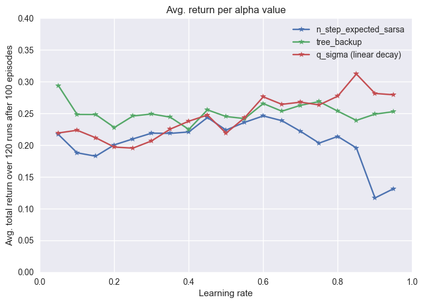
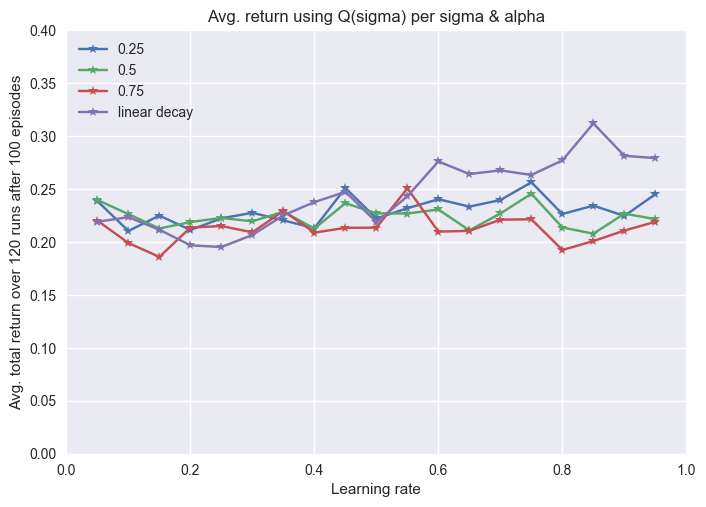

# n-step Q(σ) vs. Tree Backup vs. n-step Expected Sarsa

This project explains, implements, and compares the following algorithms:
* Off-policy n-step Expected Sarsa (target policy: greedy; behavior policy: e-greedy)
	* Sutton & Barto, "Reinforcement Learning: An introduction", 2nd ed., pg. 159
* n-step Tree Backup
	* Sutton & Barto, "Reinforcement Learning: An introduction", 2nd ed., pg. 161
* Off-policy n-step Q(sigma)
	* Sutton & Barto, "Reinforcement Learning: An introduction", 2nd ed., pg. 164

The graphs were produced by running the code in the run_experiments.py file. If you run it now it will produce the graphs from the data in the results/ folder. If you want to gather the results for yourself, make sure to delete all files in the results/ folder (or rename the folder and make a new one).

The first commit contains code that was taken from the UC Berkeley AI Course, available at: http://ai.berkeley.edu/reinforcement.html.
Second commit contains modifications for RTDP, Value Iteration DP and Gauss-Seidel DP (from prior assignment).
Third commit and onward contains changes made for this assignment.

The Gridworld code was extended to create a windy gridworld.

You can view the slides in the .pdf file, however, the video (located at figs/qsigma.mp4) is not embedded.

